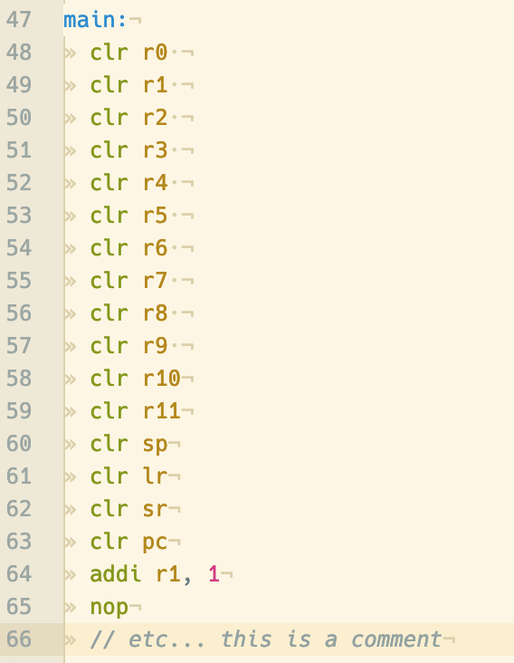

# TUK ESyLAB assembly syntax highlighting

The [Embedded Systems Lab at TUK (a.k.a. ESyLAB)](https://www.eit.uni-kl.de/eis/teaching/labs/labor-digitaltechnik2/) uses a processor design built in-house called LT16, which has its own assembly code syntax. I took the [language-x86-64-assembly](https://atom.io/packages/language-x86-64-assembly) and modified it minimally to highlight LT16 assembly syntax.

## How to get it working

It's not in the Atom package repository because it's pretty hacky and not useful to anyone that isn't writing code for that processor but it's easy enough to get it working in Atom without installing it from the Atom package repository:

1. Clone the repository and have Atom link to it
```sh
# Clone the repository
git clone https://github.com/pistoletpierre/language-lt16soc
# Go into the directory
cd language-lt16soc
# Have Atom link to it in Atom's packages directory
apm link
```
2. Open a file in Atom, press `ctrl-shift-l` and select `lt16soc` as the grammar

## Screenshot


